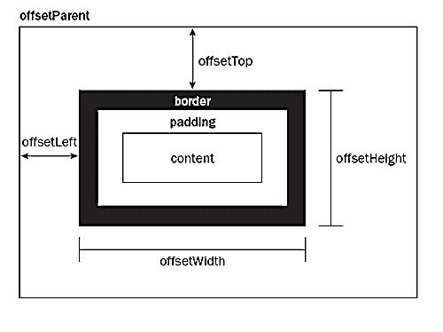
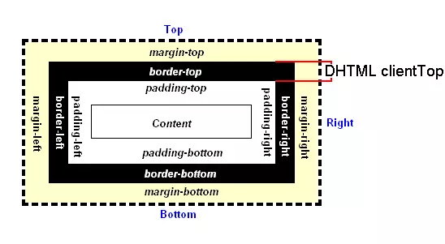
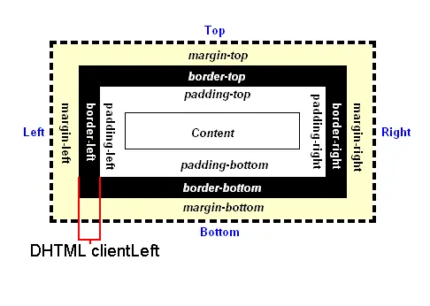
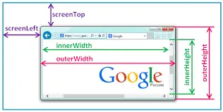
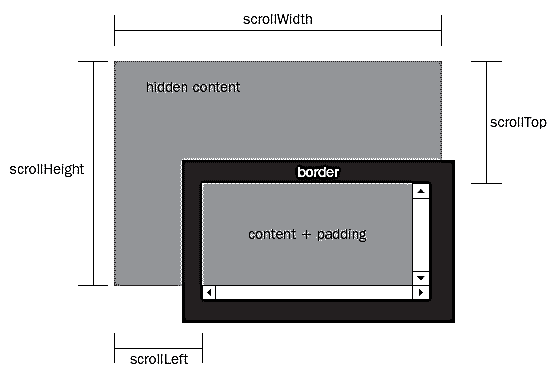

# 获取元素宽高及位置的方法

## offsetWidth / offsetHeight

[HTMLElement.offsetWidth](https://developer.mozilla.org/zh-CN/docs/Web/API/HTMLElement/offsetWidth)是一个只读属性，返回一个元素的布局宽度。一个典型的（各浏览器的offsetWidth可能有所不同）offsetWidth是测量包含元素的边框(border)、水平线上的内边距(padding)、竖直方向滚动条(scrollbar)（如果存在的话）、以及CSS设置的宽度(width)的值。

[HTMLElement.offsetHeight](https://developer.mozilla.org/zh-CN/docs/Web/API/HTMLElement/offsetHeight)是一个只读属性，它返回该元素的像素高度，高度包含该元素的垂直内边距和边框，且是一个整数。

通常，元素的`offsetHeight`是一种元素CSS高度的衡量标准，包括元素的边框、内边距和元素的水平滚动条（如果存在且渲染的话），不包含`:before`或`:after`等伪类元素的高度。

对于文档的body对象，它包括代替元素的CSS高度线性总含量高。浮动元素的向下延伸内容高度是被忽略的。

如果元素被隐藏（例如 元素或者元素的祖先之一的元素的style.display被设置为none），则返回0

``` js
let offsetWidth = element.offsetWidth;
```


::: tip 提示

`offsetWidth / offsetHeight`属性值会被四舍五入为整数值，如果你需要一个浮点数值，请用 `element.getBoundingClientRect()`.

`offsetWidth = border + paddding + content(width) + scrollbar(width)?`

`offsetHeight = border + paddding + content(height) + scrollbar(height)?`
:::

## offsetTop / offsetLeft

首先我们来看一张图



[HTMLElement.offsetTop](https://developer.mozilla.org/zh-CN/docs/Web/API/HTMLElement/offsetParent)为只读属性（`整数值`），它返回当前元素相对于其[offsetParent](https://developer.mozilla.org/zh-CN/docs/Web/API/HTMLElement/offsetParent)元素的顶部内边距的距离。

[HTMLElement.offsetLeft](https://developer.mozilla.org/zh-CN/docs/Web/API/HTMLElement/offsetLeft)是一个只读属性（`整数值`），返回当前元素左上角相对于  HTMLElement.offsetParent 节点的左边界偏移的像素值

然而，对于可被截断到下一行的行内元素（如 span），offsetTop 和 offsetLeft 描述的是第一个边界框的位置（使用 `Element.getClientRects()`来获取其宽度和高度），而 offsetWidth 和 offsetHeight 描述的是边界框的尺寸（使用 Element.getBoundingClientRect 来获取其位置）。因此，使用 offsetLeft、offsetTop、offsetWidth、offsetHeight 来对应 left、top、width 和 height 的一个盒子将不会是文本容器 span 的盒子边界。

::: tip offsetParent
HTMLElement.offsetParent 是一个只读属性，返回一个指向最近的（指包含层级上的最近）包含该元素的定位元素或者最近的 table,td,th,body元素。当元素的 style.display 设置为 "none" 时，offsetParent 返回 null。offsetParent 很有用，因为 offsetTop 和 offsetLeft 都是相对于其内边距边界的。
:::

## clientWidth / clientHeight

[Element.clientWidth](https://developer.mozilla.org/zh-CN/docs/Web/API/Element/clientWidth)为只读属性，内联元素以及没有 CSS 样式的元素的 clientWidth 属性值为 0。

Element.clientWidth 属性表示元素的内部宽度，以像素计。该属性包括内边距，但不包括垂直滚动条（如果有）、边框和外边距。

[Eelment.clientHeight](https://developer.mozilla.org/zh-CN/docs/Web/API/Element/clientHeight)这个属性是只读属性，对于没有定义CSS或者内联布局盒子的元素为0，否则，它是元素内部的高度(单位像素)，包含内边距，但不包括水平滚动条、边框和外边距。


::: tip 提示
`clientWidth / clientHeight`属性值会被四舍五入为一个整数。如果你需要一个小数值，可使用 element.getBoundingClientRect()。
:::

## clientTop / clientLeft

[Element.clientTop](https://developer.mozilla.org/zh-CN/docs/Web/API/Element/clientTop)一个元素顶部边框的宽度（以像素表示）。不包括顶部外边距或内边距。clientTop 是只读的



[Element.clientLeft](https://developer.mozilla.org/zh-CN/docs/Web/API/Element/clientLeft)表示一个元素的左边框的宽度，以像素表示。如果元素的文本方向是从右向左（RTL, right-to-left），并且由于内容溢出导致左边出现了一个垂直滚动条，则该属性包括滚动条的宽度。clientLeft 不包括左外边距和左内边距。clientLeft 是只读的。



::: tip 提示
当元素设置 display: inline 后，无论是否有边框，clientTop, clientLeft 始终返回 0 。
:::

## innerWidth / innerHeight / outerWidth / outerHeight

[window.innerWidth](https://developer.mozilla.org/zh-CN/docs/Web/API/Window/innerWidth)浏览器视口（viewport）宽度（单位：像素），如果存在垂直滚动条则包括它。

[window.innerHeight](https://developer.mozilla.org/zh-CN/docs/Web/API/Window/innerHeight)浏览器窗口的视口（viewport）高度（以像素为单位）；如果有水平滚动条，也包括滚动条高度。

[window.outerWidth](https://developer.mozilla.org/zh-CN/docs/Web/API/Window/outerWidth)获取浏览器窗口外部的宽度。表示整个浏览器窗口的宽度，包括侧边栏（如果存在）、窗口镶边（window chrome）和调正窗口大小的边框（window resizing borders/handles）。该属性为只读，没有默认值。

[window.outerHeight](https://developer.mozilla.org/zh-CN/docs/Web/API/Window/outerHeight)获取整个浏览器窗口的高度（单位：像素），包括侧边栏（如果存在）、窗口镶边（window chrome）和窗口调正边框（window resizing borders/handles）。该属性为只读，没有默认值。



::: tip 提示
innerWidth, innerHeight 属性被任一 window 对象支持，如 window、frame、frameset 或 secondary window。

`innerWidth`算法用来获取不包括垂直滚动条的视口的宽度。
`innerHeight`算法用来获取不包括垂直滚动条的视口的高度。
:::

## scrollTop / scrollLeft / scrollWidth / scrollHeight

[Element.scrollTop](https://developer.mozilla.org/zh-CN/docs/Web/API/Element/scrollTop)属性可以获取或设置一个元素的内容垂直滚动的像素数。

一个元素的 scrollTop 值是这个元素的顶部到视口可见内容（的顶部）的距离的度量。当一个元素的内容没有产生垂直方向的滚动条，那么它的 scrollTop 值为0。

[Element.scrollLeft](https://developer.mozilla.org/zh-CN/docs/Web/API/Element/scrollLeft) 属性可以读取或设置元素滚动条到元素左边的距离。

注意如果这个元素的内容排列方向（direction） 是rtl (right-to-left) ，那么滚动条会位于最右侧（内容开始处），并且scrollLeft值为0。此时，当你从右到左拖动滚动条时，scrollLeft会从0变为负数（这个特性在chrome浏览器中不存在）。

[Element.scrollWidth](https://developer.mozilla.org/zh-CN/docs/Web/API/Element/scrollWidth) 这个只读属性是元素内容宽度的一种度量，包括由于overflow溢出而在屏幕上不可见的内容。
scrollWidth值等于元素在不使用水平滚动条的情况下适合视口中的所有内容所需的最小宽度。 宽度的测量方式与clientWidth相同：它包含元素的内边距，但不包括边框，外边距或垂直滚动条（如果存在）。 它还可以包括伪元素的宽度，例如::before或::after。 如果元素的内容可以适合而不需要水平滚动条，则其scrollWidth等于clientWidth

[Element.scrollHeight](https://developer.mozilla.org/zh-CN/docs/Web/API/Element/scrollHeight) 这个只读属性是一个元素内容高度的度量，包括由于溢出导致的视图中不可见内容。

scrollHeight 的值等于该元素在不使用滚动条的情况下为了适应视口中所用内容所需的最小高度。 没有垂直滚动条的情况下，scrollHeight值与元素视图填充所有内容所需要的最小值clientHeight相同。包括元素的padding，但不包括元素的border和margin。scrollHeight也包括 ::before 和 ::after这样的伪元素。



::: tip 提示

这四个属性会进行四舍五入并返回整数，如果你需要小数形式的值，使用element.getBoundingClientRect().

1. scrollTop 可以被设置为任何整数值，同时注意：

    - 如果一个元素不能被滚动（例如，它没有溢出，或者这个元素有一个"non-scrollable"属性）， scrollTop将被设置为0。
    - 设置scrollTop的值小于0，scrollTop 被设为0
    - 如果设置了超出这个容器可滚动的值, scrollTop 会被设为最大值.

2. scrollLeft 可以是任意整数，然而：

    - 如果元素不能滚动（比如：元素没有溢出），那么scrollLeft 的值是0。
    - 如果给scrollLeft 设置的值小于0，那么scrollLeft 的值将变为0。
    - 如果给scrollLeft 设置的值大于元素内容最大宽度，那么scrollLeft 的值将被设为元素最大宽度。

:::

## scrollX / scrollY

[scrollX](https://developer.mozilla.org/zh-CN/docs/Web/API/Window/scrollX)返回文档/页面水平方向滚动的像素值:

完整的获取文档/页面在水平方向已滚动的像素值的兼容性代码：

``` js
var x = (window.pageXOffset !== undefined) ? window.pageXOffset : (document.documentElement || document.body.parentNode || document.body).scrollLeft;
```

[scrollY](https://developer.mozilla.org/zh-CN/docs/Web/API/Window/scrollY)完整的获取文档/页面在水平方向已滚动的像素值,其中 pageXOffset 属性是 scrollY 属性的别名

完整的获取文档/页面在垂直方向已滚动的像素值的兼容性代码：

``` js
var y = (window.pageYOffset !== undefined) ? window.pageYOffset : (document.documentElement || document.body.parentNode || document.body).scrollTop;

```
