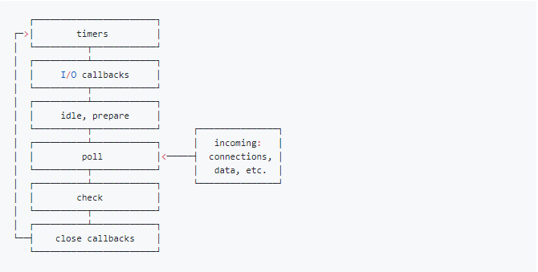
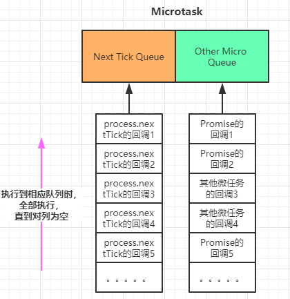

# Event Loop

我在学习浏览器和NodeJS的Event Loop时看了大量的文章，那些文章都写的很好，但是往往是每篇文章有那么几个关键的点，很多篇文章凑在一起综合来看，才可以对这些概念有较为深入的理解。

于是，我在看了大量文章之后，想要写这么一篇博客，不采用官方的描述，结合自己的理解以及示例代码，用最通俗的语言表达出来。希望大家可以通过这篇文章，了解到Event Loop到底是一种什么机制，浏览器和NodeJS的Event Loop又有什么区别。如果在文中出现书写错误的地方，欢迎大家留言一起探讨。

## Event Loop 是什么

**event loop是一个执行模型，在不同的地方有不同的实现。浏览器和NodeJS基于不同的技术实现了各自的Event Loop。**

- 浏览器的Event Loop是在[html5的规范](https://www.w3.org/TR/html5/webappapis.html#event-loops)中明确定义
- NodeJS的Event Loop是基于libuv实现的。可以参考Node的[官方文档](https://nodejs.org/en/docs/guides/event-loop-timers-and-nexttick/)以及libuv的[官方文档](http://docs.libuv.org/en/v1.x/design.html)
- libuv已经对Event Loop做出了实现，而HTML5规范中只是定义了浏览器中Event Loop的模型，具体的实现留给了浏览器厂商。

## 宏任务和微任务

**宏队列**，英文`macrotask`，也叫`tasks`。 一些异步任务的回调会依次进入`macro task queue`，等待后续被调用，这些异步任务包括：

- setTimeout
- setInterver
- setImmediate (node独有)
- requestAnimateFrame (浏览器独有)
- I/O
- UI rendering (浏览器独有)

**微队列**，microtask，也叫jobs。 另一些异步任务的回调会依次进入micro task queue，等待后续被调用，这些异步任务包括：

- process.nextTick (Node独有)
- Promise
- Object.observe
- MutationObserver

## 浏览器的Event Loop

我们先来看一张图，再看完这篇文章后，请返回来再仔细看一下这张图，相信你会有更深的理解。


这张图将浏览器的Event Loop完整的描述了出来，我来讲执行一个JavaScript代码的具体流程：

1. 执行全局Script同步代码，这些同步代码有一些是同步语句，有一些是异步语句（比如setTimeout等）
2. 局Script代码执行完毕后，调用栈Stack会清空
3. 从微队列`microtask queue`中取出位于对手的回调任务，放入到调用栈Stack中执行，执行完毕后`microtask queue`长度减一
4. 重复3的步骤，知道队列为空。**注意：如果执行`microtask`的过程中又产生了`microtask`， 那么会加入到队列的末尾**
5. `microtask queue`中的任务执行完毕，此时`microtask queue`为空，调用栈Stack也为空
6. 继续取出`macrotask queue`中位于队首的任务，放入Stack中执行，类似于3, 知道为空。**注意：如果执行产生了`microtask` 则执行完此任务后将继续执行3，直到`microtask queue`为空**
7. 不断重复3-6，反复执行

### 这就是浏览器的事件循环Event Loop

::: tip 这里归纳以下3个重点

:point_right: 宏队列macrotask一次只从队列中取一个任务执行，执行完后就去执行微任务队列中的任务

:point_right: 任务队列中所有的任务都会被依次取出来执行，知道microtask queue为空

:point_right: 图中没有画UI rendering的节点，因为这个是由浏览器自行判断决定的，但是只要执行UI rendering，它的节点是在执行完所有的microtask之后，下一个macrotask之前，紧跟着执行UI render
:::

我们来看下面是几个示例

```javascript
console.log(1);

setTimeout(() => {
  console.log(2);
  Promise.resolve().then(() => {
    console.log(3)
  });
});

new Promise((resolve, reject) => {
  console.log(4)
  resolve(5)
}).then((data) => {
  console.log(data);
})

setTimeout(() => {
  console.log(6);
})

console.log(7);
```

这里结果会是什么呢？运用上面了解到的知识，先自己做一下试试看。

::: tip 正确答案

``` js
1
4
7
5
2
3
6
```

:::

## Node的Event Loop

### libuv

下面是libuv的结构图


### NodeJS的宏队列和微队列

NodeJS的 Event Loop中， 执行宏队列的回调任务有6个阶段， 如下图


::: tip 各个阶段执行的任务如下：

- **timers阶段**: 这个阶段执行`setTimeout`和`setInterval`预定的callback
- **I/O callback阶段**: 执行除了`close`事件的callbacks、被timers设定的`callbacks`、`setImmediate`设定的callback这些之外的callback
- **idle,prepare阶段**: 仅node内部使用
- **poll阶段：获取新的I/O事件**: 适当的条件下node将阻塞在这里
- **check阶段**: 执行`setImmediate`设定的callbacks
- **close callbacks阶段**: 执行`socket.on('close', ....)`这些callbacks
:::

#### NodeJS中宏任务主要有4个

1. Timers Queue
2. IO Callback Queue
3. Check Queue
4. Close Callback Queue

这4个都是属于宏任务，但是在浏览器中，可以认为只有一个宏队列，所有的`macrotask`都会被加到这一个宏队列中，但是在NodeJS中，不同的macrotask会被放置在不同的宏队列中

#### NodeJS中微任务主要有两个

1. Next Tick Queue: 是放置`process.nextTick(callback)`的回调任务的
2. Other Micro Queue: 放置其他`microtask`, 比如Promise等

具体可以通过下面这种图加深一下理解：


大体解释一下NodeJS的Event Loop过程：

1. 执行全局Script的全局代码
2. 执行`microtask`微任务，先执行所有`Next TickQueue`中的所有任务，再执行`Other Microtask Queue`的所有任务
3. 开始执行macrotask宏任务，共6个阶段，从第1个阶段开始执行相应每一个阶段macrotask中的所有任务，注意，这里是所有每个阶段宏任务队列的所有任务，在浏览器的Event Loop中是只取宏队列的第一个任务出来执行，每一个阶段的macrotask任务执行完毕后，开始执行微任务，也就是步骤2
4. Timers Queue -> 步骤2 -> I/O Queue -> 步骤2 -> Check Queue -> 步骤2 -> Close Callback Queue -> 步骤2 -> Timers Queue ......

##### 关于NodeJS的macrotask queue和microtask queue，我画了两张图，大家作为参考




我们来看下面的示例：

``` js
console.log('start');

setTimeout(() => {          // callback1
  console.log(111);
  setTimeout(() => {        // callback2
    console.log(222);
  }, 0);
  setImmediate(() => {      // callback3
    console.log(333);
  })
  process.nextTick(() => {  // callback4
    console.log(444);  
  })
}, 0);

setImmediate(() => {        // callback5
  console.log(555);
  process.nextTick(() => {  // callback6
    console.log(666);  
  })
})

setTimeout(() => {          // callback7
  console.log(777);
  process.nextTick(() => {  // callback8
    console.log(888)
  })
}, 0);

process.nextTick(() => {    // callback9
  console.log(999);  
})

console.log('end');
```

这里结果又会是什么呢？运用上面了解到的知识，先自己做一下试试看。
::: tip 正确答案

``` js
start
end
999
111
777
444
888
555
333
666
222
 ```

:::

::: warning 注意
上面这段代码你执行的结果可能会有多种情况，因为：

:point_right: `setTimeout(fn, 0)`不是严格的0，一般是setTimeout(fn, 3)或什么，会有一定的延迟时间，当setTimeout(fn, 0)和setImmediate(fn)出现在同一段同步代码中时，就会存在两种情况。
:point_right: **第一种情况**：同步代码执行完了，Timer还没到期，setImmediate回调先注册到Check Queue中，开始执行微队列，然后是宏队列，先从Timers Queue中开始，发现没回调，往下走直到Check Queue中有回调，执行，然后timer到期（只要在执行完Timer Queue后到期效果就都一样），timer回调注册到Timers Queue中，下一轮循环执行到Timers Queue中才能执行那个timer 回调；**所以，这种情况下，setImmediate(fn)回调先于setTimeout(fn, 0)回调执行**

:point_right: **第二种情况**：同步代码还没执行完，timer先到期，timer回调先注册到Timers Queue中，执行到setImmediate了，它的回调再注册到Check Queue中。 然后，同步代码执行完了，执行微队列，然后开始先执行Timers Queue，先执行Timer 回调，再到Check Queue，执行setImmediate回调；**所以，这种情况下，setTimeout(fn, 0)回调先于setImmediate(fn)回调执行。**

:point_right: 所以，在同步代码中同时调setTimeout(fn, 0)和setImmediate情况是不确定的，但是如果把他们放在一个IO的回调，比如readFile('xx', function () {// ....})回调中，那么IO回调是在IO Queue中，setTimeout到期回调注册到Timers Queue，setImmediate回调注册到Check Queue，IO Queue执行完到Check Queue，timer Queue得到下个周期，所以setImmediate回调这种情况下肯定比setTimeout(fn, 0)回调先执行。
:::

综上，这个例子是不太好的，setTimeout(fn, 0)和setImmediate(fn)如果想要保证结果唯一，就放在一个IO Callback中吧，上面那段代码可以把所有它俩同步执行的代码都放在一个IO Callback中，结果就唯一了。

下面引入Promise再来看一个例子：

``` js
console.log('1');

setTimeout(function() {
    console.log('2');
    process.nextTick(function() {
        console.log('3');
    })
    new Promise(function(resolve) {
        console.log('4');
        resolve();
    }).then(function() {
        console.log('5')
    })
})

new Promise(function(resolve) {
    console.log('7');
    resolve();
}).then(function() {
    console.log('8')
})
process.nextTick(function() {
  console.log('6');
})

setTimeout(function() {
    console.log('9');
    process.nextTick(function() {
        console.log('10');
    })
    new Promise(function(resolve) {
        console.log('11');
        resolve();
    }).then(function() {
        console.log('12')
    })
})
```

大家仔细分析，相比于上一个例子，这里由于存在`Promise`，所以`Other Microtask Queue`中也会有回调任务的存在，执行到微任务阶段时，先执行`Next Tick Queue`中的所有任务，再执行`Other Microtask Queue`中的所有任务，然后才会进入下一个阶段的宏任务。明白了这一点，相信大家都可以分析出来，下面直接给出正确答案，如有疑问，欢迎留言和我讨论。

::: tip 正确答案

``` js
1
7
6
8
2
4
9
11
3
10
5
12
```

:::

## setTimeout 对比 setImmediate

- `setTimeout(fn, 0)`在Timers阶段执行，并且是在poll阶段进行判断是否达到指定的timer时间才会执行
- `setImmediate(fn)`在Check阶段执行

两者的执行顺序要根据当前的执行环境才能确定：

- 如果两者都在主模块(main module)调用，那么执行先后取决于进程性能，顺序随机
- 如果两者都不在主模块调用，即在一个`I/O Circle`中调用，那么`setImmediate`的回调永远先执行，因为会先到Check阶段

## setImmediate 对比 process.nextTick

- `setImmediate(fn)`的回调任务会插入到宏队列`Check Queue`中
- `process.nextTick(fn)`的回调任务会插入到微队列`Next Tick Queue`中
- `process.nextTick(fn)`调用深度有限制，上限是1000，而`setImmedaite`则没有

## 总结

1. 浏览器的Event Loop和NodeJS的Event Loop是不同的，实现机制也不一样，不要混为一谈。
2. 浏览器可以理解成只有1个宏任务队列和1个微任务队列，先执行全局Script代码，执行完同步代码调用栈清空后，从微任务队列中依次取出所有的任务放入调用栈执行，微任务队列清空后，从宏任务队列中只取位于队首的任务放入调用栈执行，注意这里和Node的区别，只取一个，然后继续执行微队列中的所有任务，再去宏队列取一个，以此构成事件循环。
3. NodeJS可以理解成有4个宏任务队列和2个微任务队列，但是执行宏任务时有6个阶段。先执行全局Script代码，执行完同步代码调用栈清空后，先从微任务队列`Next Tick Queue`中依次取出所有的任务放入调用栈中执行，再从微任务队列`Other Microtask Queue`中依次取出所有的任务放入调用栈中执行。然后开始宏任务的6个阶段，每个阶段都将该宏任务队列中的所有任务都取出来执行（注意，这里和浏览器不一样，浏览器只取一个），每个宏任务阶段执行完毕后，开始执行微任务，再开始执行下一阶段宏任务，以此构成事件循环。
4. `MacroTask`包括： `setTimeout`、`setInterval`、 `setImmediate`(Node)、`requestAnimation`(浏览器)、`IO`、`UI rendering`
5. Microtask包括： `process.nextTick`(Node)、`Promise`、`Object.observe`、`MutationObserver`
