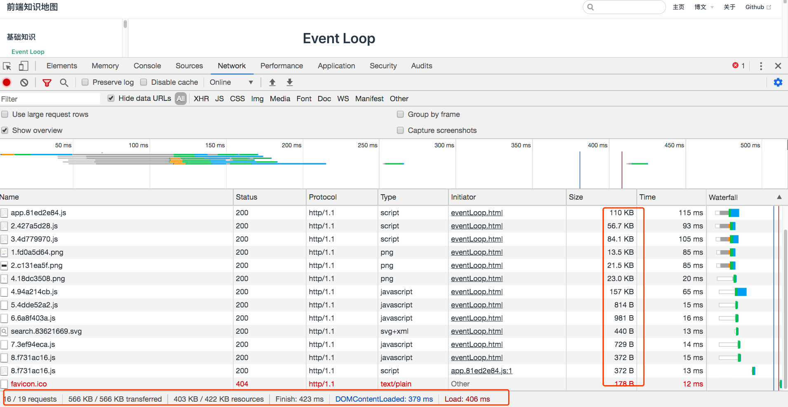
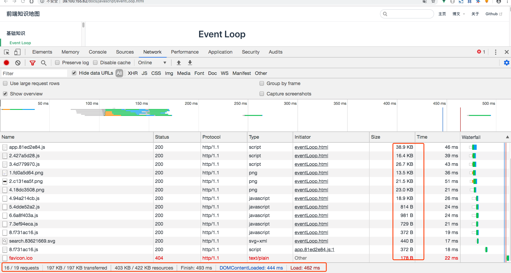
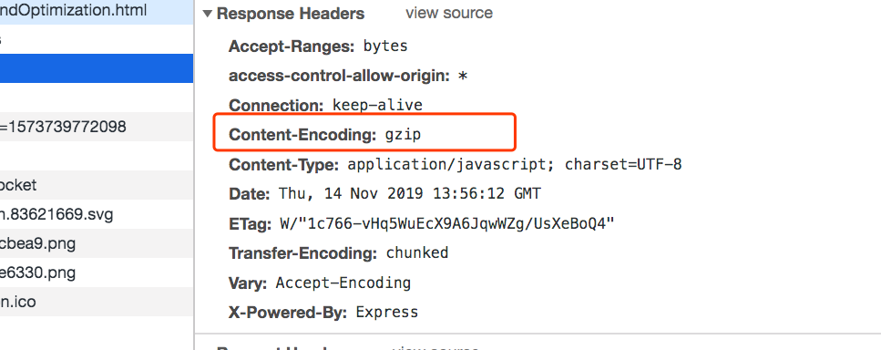
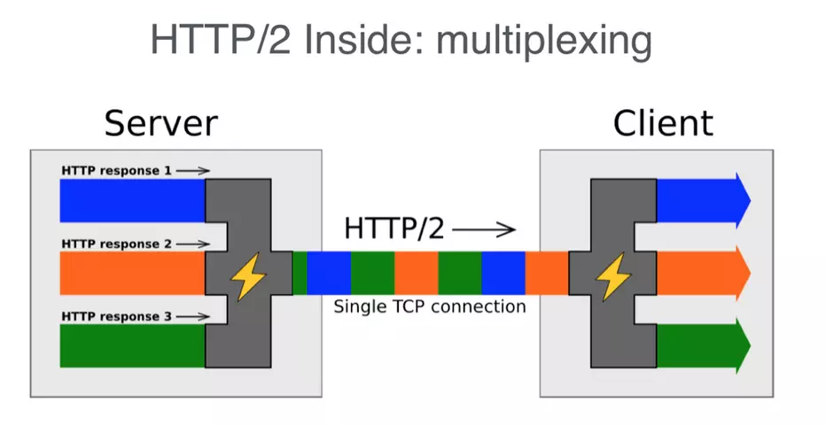
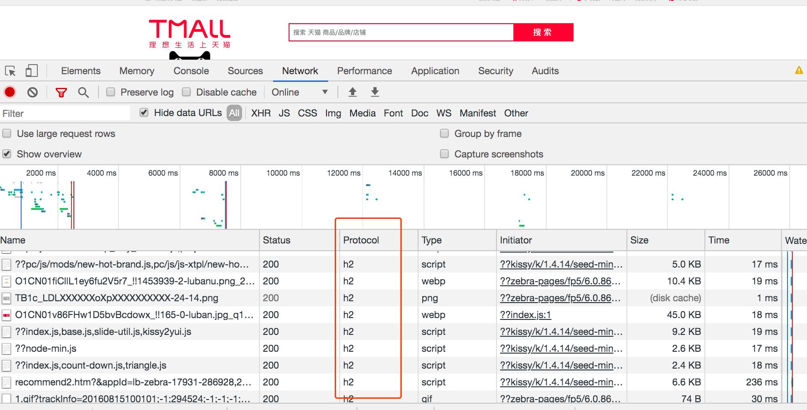
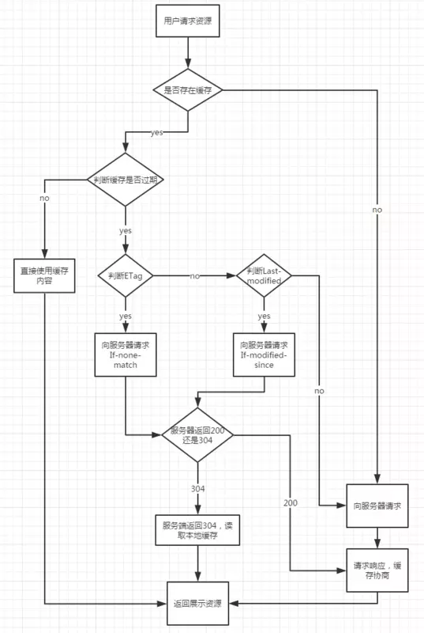
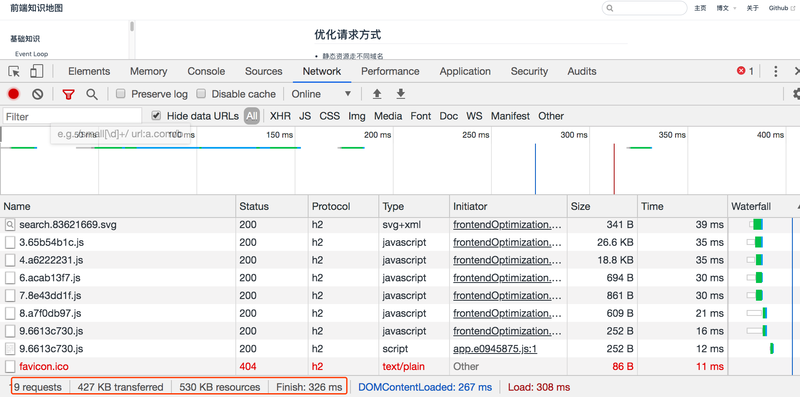
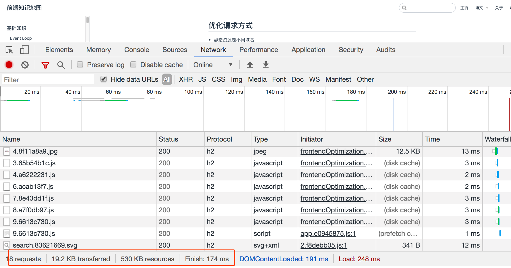

# 性能优化

## 前言

虽然前端开发作为 GUI 开发的一种,但是存在其特殊性,前端的特殊性就在于“动态”二字，传统 GUI 开发，不管是桌面应用还是移动端应用都是需要预先下载的,只有先下载应用程序才会在本地操作系统运行,而前端不同,它是“动态增量”式的,我们的前端应用往往是实时加载执行的,并不需要预先下载,这就造成了一个问题,前端开发中往往最影响性能的不是什么计算或者渲染,而是加载速度,加载速度会直接影响用户体验和网站留存。

《`Designing for Performance`》的作者 `Lara Swanson`在2014年写过一篇文章《Web性能即用户体验》，她在文中提到“网站页面的快速加载，能够建立用户对网站的信任，增加回访率，大部分的用户其实都期待页面能够在`2`秒内加载完成，而当超过`3`秒以后，就会有接近`40%`的用户离开你的网站”。

值得一提的是,GUI 开发依然有一个共同的特殊之处,那就是`体验性能`,体验性能并不指在绝对性能上的性能优化,而是回归用户体验这个根本目的,因为在 GUI 开发的领域,绝大多数情况下追求绝对意义上的性能是没有意义的.

比如一个动画本来就已经有`60`帧了,你通过一个吊炸天的算法优化到了`120`帧,这对于你的 KPI 毫无用处,因为这个优化本身没有意义,因为除了少数特异功能的异人,没有人能分得清`60`帧和`120`帧的区别,这对于用户的体验没有任何提升,相反,一个首屏加载需要 4s 的网站,你没有任何实质意义上的性能优化,只是加了一个设计姐姐设计的`loading`图,那这也是十分有意义的优化,因为好的 loading 可以减少用户焦虑,让用户感觉没有等太久,这就是用户体验级的性能优化.

说到性能优化，可能第一印象就觉得这只是前端的事情，其实这不仅仅是前端的工作，后端也是紧密相连，大家应该知道著名的**雅虎军规**，那么我们就结合这些军规谈谈性能优化的那点事

::: tip 雅虎军规

1. 尽量减少`HTTP`请求数
2. 减少`DNS`查找
3. 避免重定向
4. 让`Ajax`可缓存
5. 延迟加载组件
6. 预加载组件
7. 减少`DOM`元素的数量
8. 跨域分离组件
9. 尽量少用`iframe`
10. 杜绝`404`
11. 避免使用CSS表达式
12. 选择`<link>`舍弃`@import`
13. 避免使用滤镜
14. 把样式表放在顶部
15. 去除重复脚本
16. 尽量减少DOM访问
17. 用智能的事件处理器
18. 把脚本放在底部
19. 把`JavaScript`和`CSS`放到外面
20. 压缩`JavaScript`和`CSS`
21. 优化图片
22. 优化`CSS Sprite`
23. 不要用HTML缩放图片
24. 用小的可缓存的`favicon.ico`（P.S. 收藏夹图标）
25. 给`Cookie`减肥
26. 把组件放在不含`cookie`的域下
27. 保证所有组件都小于`25K`
28. 把组件打包到一个复合文档里
29. `Gzip`组件
30. 避免图片`src`属性为空
31. 配置`ETags`
32. 对`Ajax`用`GET`请求
33. 尽早清空缓冲区
34. 使用`CDN`（内容分发网络）
35. 添上`Expires`或者`Cache-Control` HTTP头
:::
了解[雅虎军规](https://www.cnblogs.com/xianyulaodi/p/5755079.html)

下面我总结了一些常用的手段去优化我们的资源

## 压缩合并

对于**前端性能优化**自然要关注`首屏`打开速度，而这个速度，很大因素是花费在网络请求上，那么怎么减少网络请求的时间呢？

- 尽量减少`HTTP`请求数
- 压缩`JavaScript`和`CSS`
- 使用`CDN`（内容分发网络
- webpack打包开启Gzip
- CSS Sprite

`CSS Spirite`就是把一些小图用 PS 合成一张图，用 css 定位显示每张图片的位置

``` css
.top_right .phone {
    background: url(../images/top_right.png) no-repeat 7px -17px;
    padding: 0 38px;
}

.top_right .help {
    background: url(../images/top_right.png) no-repeat 0 -47px;
    padding: 0 38px;
}
```

所以`压缩`、`合并` 就是一个解决方案，当然目前较多使用`webpack`等构建工具 压缩、合并。开启方式，在脚手架中修改配置文件：`/config/index.js`

```js
// 生产模式
build: {
  productionGzip: true // 开启Gzip压缩
}
```

同时服务端`nginx`加入配置项

``` shell
gzip on;
gzip_min_length 1k;
gzip_buffers 4 16k;
gzip_comp_level 6;
gzip_types application/javascript text/plain application/x-javascript text/css application/xml text/javascript application/json;
gzip_vary on;
```

nginx开起Gzip前


nginx开启GZIP后



很明显后者文件大小明显比前面小很多

## 优化请求方式

- 静态资源走不同域名
- 开启http2
- preload 与 prefetch
- defer 与 async
- DNS预解析

### 静态资源走不同域名

在非http2中，由于浏览器限制，同一个域名TCP链接的数量有限，所有当该域名的请求值到达最大值时，将无法建立新的链接，必须等待前面的请求完成，所有当放在不同的域名下时，这个问题就迎刃而解了

### HTTP2

说到http2,我就来普及下http2了

::: tip HTTP2是什么：
HTTP2.0可以说是SPDY的升级版（其实原本也是基于SPDY设计的），但是，HTTP2.0 跟 SPDY 仍有不同的地方，主要是以下两点

- HTTP2.0 支持明文`HTTP`传输，而`SPDY`强制使用`HTTPS`
- HTTP2.0 消息头的压缩算法采用`HPACK`，而非`SPDY`采用的`DEFLATE`

**HTTP2新特性**:

- **新的二进制格式（`Binary Format`）**: HTTP1.x的解析是基于文本。基于文本协议的格式解析存在天然缺陷，文本的表现形式有多样性，要做到健壮性考虑的场景必然很多，二进制则不同，只认0和1的组合。基于这种考虑HTTP2.0的协议解析决定采用二进制格式，实现方便且健壮

- **多路复用（`MultiPlexing`）**: 即连接共享，即每一个request都是是用作连接共享机制的。一个request对应一个id，这样一个连接上可以有多个request，每个连接的request可以随机的混杂在一起，接收方可以根据request的 id将request再归属到各自不同的服务端请求里面。多路复用原理图：


- **header压缩**: HTTP1.x的`header`带有大量信息，而且每次都要重复发送，`HTTP2.0`使用`encoder`来减少需要传输的`header`大小，通讯双方各自`cache`一份`header fields`表，既避免了重复`header`的传输，又减小了需要传输的大小

- **服务端推送（`server push`**: 同SPDY一样，HTTP2.0也具有server push功能。

目前，有大多数网站已经启用HTTP2.0，例如YouTuBe，淘宝网等网站，利用chrome控制台可以查看是否启用H2：开发中工具中的Network=>Name栏右键=>√Protocol

这是天猫的请求:


nginx[升级支持http2](https://www.cnblogs.com/bugutian/p/6628455.html)
:::

### preload 与 prefetch

当浏览器构建 DOM 的时候，如果在 HTML 中遇到了一个`<script>...</script>`标签，它必须立即执行。如果脚本是来自于外部的，那么它必须首先下载脚本。著作权归作者所有。

在过去，为了执行一个脚本，HTML 的解析必须暂停。只有在 JavaScript 引擎执行完代码之后它才会重新开始解析。

使用Vue的同学应该见过编译后的html源码，类似于这样：

``` html
<head>
    <link rel="preload" href="/assets/css/0.styles.6114eb0d.css" as="style">
    <link rel="preload" href="/assets/js/app.e0945875.js" as="script">
    <link rel="preload" href="/assets/js/2.f8debb05.js" as="script">
    <link rel="preload" href="/assets/js/5.1e6bffbf.js" as="script">
    <link rel="prefetch" href="/assets/js/3.65b54b1c.js">
    <link rel="prefetch" href="/assets/js/4.a6222231.js">
    <link rel="prefetch" href="/assets/js/6.acab13f7.js">
    <link rel="prefetch" href="/assets/js/7.8e43dd1f.js">
    <link rel="prefetch" href="/assets/js/8.a7f0db97.js">
    <link rel="prefetch" href="/assets/js/9.6613c730.js">
    <link rel="stylesheet" href="/assets/css/0.styles.6114eb0d.css">
</head>
```

::: tip preload与prefech:
**preload**：`<link>`元素的`rel`属性的属性值`preload`能够让你在你的HTML页面中`<head>`元素内部书写一些声明式的资源获取请求，可以指明哪些资源是在页面加载完成后即刻需要的。对于这种即刻需要的资源，你可能希望在页面加载的生命周期的早期阶段就开始获取，在浏览器的主渲染机制介入前就进行预加载。这一机制使得资源可以更早的得到加载并可用，且更不易阻塞页面的初步渲染，进而提升性能

**prefetch**：它的作用是告诉浏览器加载下一页面可能会用到的资源，注意，是下一页面，而不是当前页面。因此该方法的加载优先级非常低，也就是说该方式的作用是加速下一个页面的加载速度

更多信息，可以通过以下了解：

- [MDN preload](https://developer.mozilla.org/zh-CN/docs/Web/HTML/Preloading_content)
- [preload有什么好处](http://www.alloyteam.com/2016/05/preload-what-is-it-good-for-part1/)
:::

> `preload`是告诉浏览器页面必定需要的资源，浏览器一定会加载这些资源
>
> `prefetch`是告诉浏览器页面可能需要的资源，浏览器不一定会加载这些资源

所以，对于当前页面很有必要的资源使用`preload`，对于可能在将来的页面中使用的资源使用`prefetch`, 不这两个在一些低版本还不支持

### defer 与 async

- `<script src="script.js"></script>`
没有`defer`或`async`，浏览器会立即加载并执行指定的脚本，“立即”指的是在渲染该`script`标签之下的文档元素之前，也就是说不等待后续载入的文档元素，读到就加载并执行。
- `<script async src="script.js"></script>`
有`async`，加载和渲染后续文档元素的过程将和`script.js`的加载与执行并行进行（异步）。
- `<script defer src="myscript.js"></script>`
有 defer，加载后续文档元素的过程将和 script.js 的加载并行进行（异步），但是 script.js 的执行要在所有元素解析完成之后，DOMContentLoaded 事件触发之前完成。

然后从实用角度来说呢，首先把所有脚本都丢到 `</body>` 之前是最佳实践，因为对于旧浏览器来说这是唯一的优化选择，此法可保证非脚本的其他一切元素能够以最快的速度得到加载和解析。

接着，我们来看一张图咯：蓝色线代表网络读取，红色线代表执行时间，这俩都是针对脚本的；绿色线代表 HTML 解析。


此图告诉我们以下几个要点：

- `defer`和`async`在网络读取（下载）这块儿是一样的，都是异步的（相较于`HTML`解析）
- 俩的差别在于脚本下载完之后何时执行，显然`defer`是最接近我们对于应用脚本加载和执行的要求的
- 关于`defer`，此图未尽之处在于它是按照加载顺序执行脚本的，这一点要善加利用
- `async`则是一个乱序执行的主，反正对它来说脚本的加载和执行是紧紧挨着的，所以不管你声明的顺序如何，只要它加载完了就会立刻执行

### 综上`preload`、`prefetch`、`async`、`defer`完美结构

``` html
<!DOCTYPE html>
<html>
<head>
  <meta charset="utf-8">
  <title>Faster</title>
  <link rel="dns-prefetch" href="//cdn.cn/">

  <link rel="preload" href="//cdn.cn/webfont.woff2" as="font">
  <link rel="preload" href="//cdn.cn/Page1-A.js" as="script">
  <link rel="preload" href="//cdn.cn/Page1-B.js" as="script">
  
  <link rel="prefetch" href="//cdn.cn/Page2.js">
  <link rel="prefetch" href="//cdn.cn/Page3.js">
  <link rel="prefetch" href="//cdn.cn/Page4.js">

  <style type="text/css">
    /* 首页用到的CSS内联 */
  </style>
</head>
<body>

<script type="text/javascript" src="//cdn.cn/Page1-A.js" defer></script>
<script type="text/javascript" src="//cdn.cn/Page1-B.js" defer></script>
</body>
</html>
```

::: tip 解读
首先，`Parser`在遇到`head`中`preload`时开始下载`JS`，读到`script`标签的时候，如果已经下载完了，直接按顺序执行之。如果没下载完，则会等到下载完再执行。这样就可以在刚进入页面时开始非阻塞的下载JS代码了。

其次，页面会在空闲时，加载`prefetch`的`JS`，如果之后页面发生跳转，跳转的目标页面引入了prefetch.js，浏览器会直接从disk缓存中读取执行。

将script标签依然放在`</body>`之前，并增加defer标签，确保老浏览器兼容，并在所有DOM元素解析完成之后执行其中的代码。

至此，完美的HTML结构出炉了。
:::

更多内容可以查看：

- [浏览器工作原理](https://www.html5rocks.com/zh/tutorials/internals/howbrowserswork/#Webkit_CSS_parser)
- [现代浏览器性能优化-CSS篇](https://segmentfault.com/a/1190000012643583)
- [现代浏览器性能优化-JS篇](https://segmentfault.com/a/1190000011577248)

### DNS预解析

在前端优化中与 DNS 的有关一般有两点： 一个是减少DNS的请求次数，另一个就是进行DNS预获取。DNS作为互联网的基础协议，往往容易被网站优化人员忽略。

>DNS全称为`Domain Name System`，即域名系统，是域名和IP地址相互映射的一个分布式数据库。
域名解析即通过主机名，最终得到该主机名对应的IP地址的过程。
浏览器对网站第一次的域名DNS解析查找流程依次为：
浏览器缓存 - 系统缓存 - 路由器缓存 - ISP DNS缓存 - 递归搜索

DNS请求需要的带宽非常小，但是延迟却有点高，这点在手机网络上特别明显，而一次典型的DNS解析一般需要20-200ms，所以DNS预解析可以让延迟明显减少一些。
在某些浏览器中这个预读取的行为将会与页面实际内容并行发生（而不是串行）。正因如此，某些高延迟的域名的解析过程才不会卡住资源的加载。
这样可以极大的加速（尤其是移动网络环境下）页面的加载。在某些图片较多的页面中，在发起图片加载请求之前预先把域名解析好将会有至少 5% 的图片加载速度提升。

`X-DNS-Prefetch-Control`头控制着浏览器的DNS预解析功能
`X-DNS-prefetch-Control`: `on|off`
`on`：启用DNS预解析。在浏览器支持DNS预解析的特性时及时不适用该标签浏览器依然会进行预解析。
`off`：关闭DNS预解析。这个属性在页面上的链接并不是由你控制的或是你根本不想向这些域名引导数据时非常有用。

使用示例：

``` html
// 打开和关闭DNS预读取
<meta http-equiv="x-dns-prefetch-control" content="off">
// 强制查询特定主机名
<link rel="dns-prefetch" href="//www.baidu.com">
```

## 浏览器缓存

缓存会根据请求保存输出内容的副本，例如 页面、图片、文件，当下一个请求来到的时候:如果是相同的`URL`，缓存直接使 用本地的副本响应访问请求，而不是向源服务器再次发送请求。因此，可以从以下 2 个方面提升性能。

- 减少相应延迟，提升响应时间
- 减少网络带宽消耗，节省流量



### 强缓存

我们先罗列一下和强缓存相关的请求响应头。

- **Expires**:  这是`http1.0`时的规范，它的值为一个绝对时间的GMT格式的时间字符串，如`Mon, 10 Jun 2015 21:31:12 GMT`，如果发送请求的时间在`expires`之前，那么本地缓存始终有效，否则就会发送请求到服务器来获取资源
- **Cache-Control**:

    1. **`max-age=number`**：这是`http1.1`时出现的`header`信息，主要是利用该字段的`max-age`值来进行判断，它是一个相对值；资源第一次的请求时间和`Cache-Control`设定的有效期，计算出一个资源过期时间，再拿这个过期时间跟当前的请求时间比较，如果请求时间在过期时间之前，就能命中缓存，否则未命中，
    2. **no-cache**： 不使用本地缓存。需要使用缓存协商，先与服务器确认返回的响应是否被更改，如果之前的响应中存在 ETag ，那么请求的时候会与服务端验证，如果资源未被更改，则可以避免重新下载。
    3. **no-store**： 直接禁止游览器缓存数据，每次用户请求该资源，都会向服务器发送一个请求，每次都会下载完整的资源。
    4. **public**： 可以被所有的用户缓存，包括终端用户和`CDN`等中间代理服务器。
    5. **private**： 只能被终端用户的浏览器缓存，不允许`CDN`等中继缓存服务器对其缓存。

::: tip 提示
如果 cache-control 与 expires 同时存在的话，cache-control 的优先级高于 expires

强缓存又分 `memory cache` 和 `disk cache`
:::

### 协商缓存

商缓存都是由浏览器和服务器协商，来确定是否缓存，协商主要通过下面两组`header`字段，这两组字段都是成对出现的，即第一次请求的响应头带上某个字段 （`Last-Modified`或者`Etag`） ，则后续请求会带上对应的请求字段（`If-Modified-Since`或者`If-None-Match`） ，若响应头没有`Last-Modified`或者`Etag`字段，则请求头也不会有对应的字段。

#### Last-Modified/If-Modified-Since

二者的值都是`GMT`格式的时间字符串，具体过程

- 浏览器第一次跟服务器请求一个资源，服务器在返回这个资源的同时，在`respone`的`header`加上 `Last-Modified`字段，这个`header`字段表示这个资源在服务器上的最后修改时间
- 浏览器再次跟服务器请求这个资源时，在`request`的`header`上加上`If-Modified-Since`字段，这个`header`字段的值就是上一次请求时返回的`Last-Modified`的值
- 服务器再次收到资源请求时，根据浏览器传过来`If-Modified-Since`和资源在服务器上的最后修改时间判断资源是否有变化，如果没有变化则返回`304 Not Modified`，但是不会返回资源内容；如果有变化，就正常返回资源内容。当服务器返回`304 Not Modified`的响应时,`response header`中不会再添加`Last-Modified`的`header`，因为既然资源没有变化，那么`Last-Modified`也就不会改变，这是服务器返回`304`时的`response header`
- 浏览器收到`304`的响应后，就会从缓存中加载资源
- 如果协商缓存没有命中，浏览器直接从服务器加载资源时,`Last-Modified`的`Header`在重新加载的时候会被更新，下次请求时,`If-Modified-Since`会启用上次返回的Last-Modified值

### Etag/If-None-Match

有些情况下仅判断最后修改日期来验证资源是否有改动是不够的：

- 存在周期性重写某些资源，但资源实际包含的内容并无变化；
- 被修改的信息并不重要，如注释等；
- Last-Modified无法精确到毫秒，但有些资源更新频率有时会小于一秒。

为解决这些问题，http允许用户对资源打上标签(ETag)来区分两个相同路径获取的资源内容是否一致。通常会采用MD5等密码散列函数对资源编码得到标签(强验证器)；或者通过版本号等方式，如W/”v1.0”(W/表示弱验证器)。

ETag为相应头部字段，表示资源内容的唯一标识，随服务器response返回；
If-None-Match为请求头部字段，服务器通过比较请求头部的If-None-Match与当前资源的ETag是否一致来判断资源是否在两次请求之间有过修改，如果没有修改，则命中协商缓存，浏览器从缓存中获取资源；如果有过修改，则服务器返回资源，同时返回新的ETag

::: tip 提示
协商缓存管理 [Last-Modified , If-Modified-Since]和[ETag , If-None-Match]一般同时启用，这是为了处理Last-Modified不可靠的情况。

所以当`ETag`和`Last-Modified`一起使用时，服务器会优先验证`ETag`，一致的情况下，才会继续比对`Last-Modified`，最后才决定是否返回304。
:::

所以，我们可以根据实际情况设置强缓存与协商缓存

首次请求未命中强缓存的效果:


再次刷新请求命中强缓存的效果：

