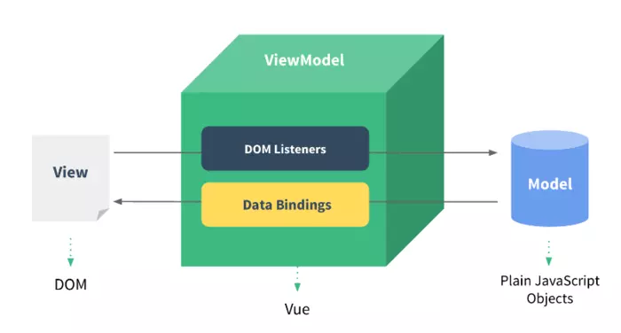
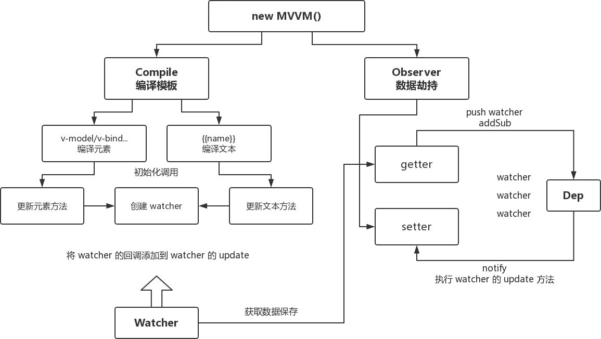
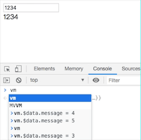
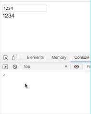
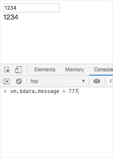

# 简单实现一个MVVM

## MVVM 是什么

MVVM 设计模式，是由 MVC（最早来源于后端）、MVP 等设计模式进化而来，M - 数据模型（Model），VM - 视图模型（ViewModel），V - 视图层（View）。
在 MVC 模式中，除了 Model 和 View 层以外，其他所有的逻辑都在 Controller 中，Controller 负责显示页面、响应用户操作、网络请求及与 Model 的交互，随着业务的增加和产品的迭代，Controller 中的处理逻辑越来越多、越来越复杂，难以维护。为了更好的管理代码，为了更方便的扩展业务，必须要为 Controller “瘦身”，需要更清晰的将用户界面（UI）开发从应用程序的业务逻辑与行为中分离，MVVM 为此而生。

很多 MVVM 的实现都是通过数据绑定来将 View 的逻辑从其他层分离，可以用下图来简略的表示：


使用 MVVM 设计模式的前端框架很多，其中渐进式框架 Vue 是典型的代表，并在开发使用中深得广大前端开发者的青睐，我们这篇就根据 Vue 对于 MVVM 的实现方式来简单模拟一版 MVVM 库。

## MVVM的流分析

在Vue的MVVM设计中，我们主要针对`Compile`(模板编译)、`Observer`(数据劫持)、`Watcher`(数据监听)和`Dep`(发布订阅)几个部分来实现，核心逻辑可参照下图：



## MVVM类的实现

在Vue中，对外只暴露一个名为Vue的构造函数，在使用的时候`new`一个Vue实例，然后传入一个`options`参数，类型为一个对象，包括当前`Vue`实例的作用于`el`、模板板顶的数据`data`等

我们模拟这种MVVM模式的时候也构建一个类，名字就叫MVVM，在使用时同Vue框架类似，需要通过`new`创建`MVVM`的实例并传入`options`

在新工程目录下新建MVVM.js文件

```js
class MVVM {
    constructor(options) {
        this.$el = options.el
        this.$data = options.data

        if (this.$el) {
            new Observer(this.$data)
        }
    }
}
```

::: tip 思路

- 我们先实现对数据的劫持
:::

接下来我们来实现对数据的劫持类Observer，在同级目录下新建observer.js

```js
class Observer {
    constructor(data) {
        this.observer(data)
    }

    observer(data) {
        if (!data || typeof data != 'object') { // 只有object才需要劫持
            return
        }
        let _value
        Object.keys(data).forEach(key => {
            _value = data[key]
            Object.defineProperty(data, key, {
                enumerable: true,
                configurable: true,
                get() {
                    console.log(`你获取了${key}`)
                    return _value
                },
                set(newValue) {
                    console.log(`${key}变为${newValue}`)
                    _value = newValue
                }
            })
        })
    }
}

```

此时将这两个js引入到测试index.html，如下

``` html
<!DOCTYPE html>
<html lang="en">
<head>
    <meta charset="UTF-8">
    <meta name="viewport" content="width=device-width, initial-scale=1.0">
    <meta http-equiv="X-UA-Compatible" content="ie=edge">
    <title>Document</title>
    <script src="./observer.js"></script>
    <script src="./MVVM.js"></script>
</head>
<body>
    <div id="app">
        <input type="text" v-model="message">
    </div>
    <script>
        var vm = new MVVM({
            el: '#app',
            data: {
                message: '1234'
            }
        })
    </script>
</body>
</html>

```

得到的效果如下图所示


由图中可知，当我们获取值得时候就可以调用`get`方法，当我们设置值得时候就可以调用`set`方法。所以当我们从编译模板渲染数据时（类似于`{{message}}`）会调用我们的`get`方法，我们就可以知道哪些地方使用了该数据, 下面我们就来实现编译魔板的方法 `Compile`

### 1、解析根节点内的 Dom 结构

这里我们使用文档碎片，比真实的DOM快

``` js
class Compile {
    constructor(el, vm) {
        // 获取DOM节点
        this.el = this.isElementNode(el) ? el : document.querySelector(el);
        this.vm = vm

        if (this.el) {
            // 1、把这些真实的 Dom 移动到内存中，即 fragment（文档碎片）
            let frament = this.node2fragment(this.el);
        }
    }
    // 判断是否是元素节点
    isElementNode(node) {
        return node.nodeType === 1
    }

    node2fragment(el) {
        // 创建文档碎片
        let frament = documennt.createDocumentFragmen()

        // 第一个子节点
        let firstChild
        while (firstChild = el.firstChild) {
            frament.appendChild(firstChild)
        }

        return frament
    }
}

```

上面的模板编译的过程中，前提条件是必须存在根节点，传入的根元素可以使一个真实的`DOM`，也可以是一个`CSS`选择器，我们利用`isElementNode`方法去判断节点是否是元素(`element`)节点，如果不是则获取节点，然后赋值给`this.el`属性中

解析模板的过程中为了提高性能，我们应取出根节点内的子节点存放在文档碎片中（内存），需要注意的是将一个 Dom 节点内的子节点存入文档碎片的过程中，会在原来的`DOM`容器中删除这个节点，所以在遍历根节点的子节点时，永远是将第一个节点取出存入文档碎片，直到节点不存在为止。

### 2、编译文档碎片中的结构

在Vue中模板编译主要是以下两部分：

- 元素节点中的指令（比如`v-model`)
- 文本中的双大括号`{{}}`（`Mustache`语法）

我们开始解析这些指令和双大括号，在Compile中增加compile方法,首先我们来实现v-model指令的编译

``` js {32-95}
class Compile {
    constructor(el, vm) {
        // 获取DOM节点
        this.el = this.isElementNode(el) ? el : document.querySelector(el);
        this.vm = vm

        if (this.el) {
            // 1、把这些真实的 Dom 移动到内存中，即 fragment（文档碎片）
            let frament = this.node2fragment(this.el);
            this.compile(frament)
            this.el.appendChild(frament)
        }
    }
    // 判断是否是元素节点
    isElementNode(node) {
        return node.nodeType === 1
    }

    node2fragment(el) {
        // 创建文档碎片
        let frament = document.createDocumentFragment()

        // 第一个子节点
        let firstChild
        while (firstChild = el.firstChild) {
            frament.appendChild(firstChild)
        }

        return frament
    }

    /************** 新增代码 ******************/
    // 解析文档碎片
    // 判断属性是否为指令
    isDirective(name) {
        return name.includes("v-")
    }

    compile(fragment) {
        // 获取子节点
        let childNodes = fragment.childNodes

        childNodes.forEach(node => {
            if (this.isElementNode(node)) { // 元素节点
                // 循环遍历
                this.compile(node)
                this.compileElement(node)
            } else {
                // todo
            }
        })
    }

    compileElement(node) {
        let attrs = node.attributes
        Array.from(attrs).forEach(attr => {
            // 获取属性名，判断属性是否为指令，即含 v-
            let attrName = attr.name

            if (this.isDirective(attrName)) {
                // 如果是指令，取到该属性值得变量在 data 中对应得值，替换到节点中
                let exp = attr.value
                let type = attrName.slice(2)

                // 调用指令对应的方法
                CompileUtil[type](node, this.vm, exp)
            }
        })
    }
}

const CompileUtil = {
    getVal(vm, exp) {
        exp = exp.split('.')
        let value = exp.reduce((prev, next) => {
            return prev[next]
        }, vm.$data)
        return value
    },
    // 暂时我们只实现model指令
    model(node, vm, exp) {
        let updateFn = this.updater.modelUpdater

         // 获取 data 中对应的变量的值
        let value = this.getVal(vm, exp);
        updateFn && updateFn(node, value)
    },

    updater: {
        modelUpdater(node, value) {
            node.value = value
        }
    }
}

```

::: tip
上面我们通过节点的`attricutes`方法获取所有属性，再去匹配含有`v-`前缀的为指令，我们获取到该属性的value(即位要编译的属性), 比如上面`type='model'`时,我们把`input`的`value`设置为`vm.$data.message`
:::

下面我们再来实现text节点的编译：

```js {13-14}
calss Compile {
    ...
    compile(fragment) {
        // 获取子节点
        let childNodes = fragment.childNodes

        childNodes.forEach(node => {
            if (this.isElementNode(node)) { // 元素节点
                // 循环遍历
                this.compile(node)
                this.compileElement(node)
            } else {
                // 新增代码
                this.compileText(node)
            }
        })
    }
    // 新增方法
    compileText(node) {
        let expr = node.textContent
        let reg = /\{\{([^}]+)\}\}/
        if (reg.test(expr)) {
            CompileUtil['text'](node, this.vm, expr)
        }
    }

    ...
}
```

CompileUtil新增方法：

``` js {4-14}

let CompileUtil = {
    ...
    getTextVal(vm, exp) {
        return exp.replace(/\{\{(([^}]+))\}\}/g, (...arguments) => {
            return this.getVal(vm, arguments[1])
        })
    },
    text(node, vm, exp) {
        let updateFn = this.updater.textUpdater
        // 获取 data 中对应的变量的值
        let value = this.getTextVal(vm, exp)
        updateFn && updateFn(node, value)
    },
    updater: {
        textUpdater(node, value) {
            node.textContent = value
        },
        ...
    }
    ...
}

```

这样我们就初步完成了模板的编译，以下是显示效果

我们可以看到，数据可以渲染，但是并数据输入并不会改变下面的显示，这是因为我们还并没有实现依赖的收集，我们在编译的时候增加一个Wathcer,新增一个watcher类

## 观察者Watcher类的实现

在 CompileUtil 对象的方法中创建 Watcher 实例的时候传入了三个参数，即 MVVM 的实例、模板绑定数据的变量名 exp 和一个 callback，这个 callback 内部逻辑是为了更新数据到 Dom，所以我们的 Watcher 类内部要做的事情就清晰了，获取更改前的值存储起来，并创建一个 update 实例方法，在值被更改时去执行实例的 callback 以达到视图的更新。

CompileUtil更改

``` js {7-9}

model(node, vm, exp) {
        let updateFn = this.updater.modelUpdater

        // 获取 data 中对应的变量的值
        let value = this.getVal(vm, exp);
        new Watcher(vm, exp, (newValue) => {
            updateFn && updateFn(node, newValue)
        })
        updateFn && updateFn(node, value)
    },

    text(node, vm, exp) {
        let updateFn = this.updater.textUpdater
        // 获取 data 中对应的变量的值
        let value = this.getTextVal(vm, exp)
        exp.replace(/\{\{(([^}]+))\}\}/g, (...arguments) => {
            new Watcher(vm, arguments[1].trim(), (newValue) => {
                updateFn && updateFn(node, newValue)
            })
        })
        updateFn && updateFn(node, value)
    },
```

Wacher类的实现

```js
class Watcher {
    constructor(vm, expr, cb) {
        this.vm = vm
        this.expr = expr
        this.cb = cb
        this.value = this.get()
    }
    getVal(vm, expr) {
        expr = expr.split('.')
        return expr.reduce((prev, next) => {
            return prev[next]
        }, vm.$data)
    }
    get() {
        Dep.target = this
        let value = this.getVal(this.vm, this.expr)
        Dep.target = null
        return value
    }

    update() {
        let newValue = this.getVal(this.vm, this.expr)
        let oldValue = this.value
        if (newValue !== oldValue) {
            this.cb(newValue)
        }
    }
}

```

当我们`new Watcher`一个观察者实例`wacher`时，构造函数就会调用`this.get`方法, 我们设置`Dep.target = this`,接着调用`this.getVal`方法， 就会触发Observer中数据拦截中的`get`方法，我们把这个wacher进行缓存，接着我们把`Dep.target`设置为空，完成本次依赖的手机
下面我们看看修改后的`observer.js`

``` js

class Observer {
    constructor (data) {
        this.observe(data);
    }
    // 添加数据监听
    observe(data) {
        // 验证 data
        if(!data || typeof data !== 'object') {
            return;
        }

        // 要对这个 data 数据将原有的属性改成 set 和 get 的形式
        // 要将数据一一劫持，先获取到 data 的 key 和 value
        Object.keys(data).forEach(key => {
            // 劫持（实现数据响应式）
            this.defineReactive(data, key, data[key]);
            this.observe(data[key]); // 深度劫持
        });
    }
    // 数据响应式
    defineReactive (object, key, value) {
        let _this = this;
        // 每个变化的数据都会对应一个数组，这个数组是存放所有更新的操作
        let dep = new Dep();

        // 获取某个值被监听到
        Object.defineProperty(object, key, {
            enumerable: true,
            configurable: true,
            get () { // 当取值时调用的方法
                Dep.target && dep.addSub(Dep.target);
                return value;
            },
            set (newValue) { // 当给 data 属性中设置的值适合，更改获取的属性的值
                if(newValue !== value) {
                    _this.observe(newValue); // 重新赋值如果是对象进行深度劫持
                    value = newValue;
                    dep.notify(); // 通知所有人数据更新了
                }
            }
        });
    }
}


class Dep {
    constructor() {
        this.subs = []
    }

    addSub(watcher) {
        this.subs.push(watcher)
    }

    notify() {
        this.subs.forEach(watcher => watcher.update())
    }
}

class Dep {
    constructor() {
        this.subs = []
    }
    //订阅 添加watcher
    addSub(watcher) {
        this.subs.push(watcher)
    }
    // 循环触发，wacher.update方法
    notify() {
        this.subs.forEach(watcher => watcher.update())
    }
}

```

::: tip 原理
在的代码中`observe`的目的是遍历对象，在内部对数据进行劫持，即添加 `getter` 和 `setter`，我们把劫持的逻辑单独抽取成 `defineReactive` 方法，需要注意的是 `observe` 方法在执行最初就对当前的数据进行了数据类型验证，然后再循环对象每一个属性进行劫持，目的是给同为 `Objec`t 类型的子属性递归调用 `observe` 进行深度劫持。
在 `defineReactive` 方法中，创建了 `Dep` 的实例，并对 `data` 的数据使用 `get` 和 `set` 进行劫持，还记得在模板编译的过程中，遇到模板中绑定的变量，就会解析，并创建 `watcher`，会在 `Watcher` 类的内部获取旧值，即当前的值，这样就触发了 `get`，在 `get`中就可以将这个 `watcher`添加到 `Dep` 的 `subs` 数组中进行统一管理，因为在代码中获取 `data` 中的值操作比较多，会经常触发 `get`，我们又要保证 `watcher` 不会被重复添加，所以在 Watcher 类中，获取旧值并保存后，立即将 `Dep.target` 赋值为 null，并且在触发 `get` 时对 `Dep.target` 进行了短路操作，存在才调用 `Dep` 的 `addSub` 进行添加。
而 `data` 中的值被更改时，会触发 `set`，在 `set` 中做了性能优化，即判断重新赋的值与旧值是否相等，如果相等就不重新渲染页面，不等的情况有两种，如果原来这个被改变的值是基本数据类型没什么影响，如果是引用类型，我们需要对这个引用类型内部的数据进行劫持，因此递归调用了 `observe`，最后调用 `Dep` 的 `notify` 方法进行通知，执行 `notify` 就会执行 `subs` 中所有被管理的 `watcher` 的 `update`，就会执行创建 `watcher` 时的传入的 callback，就会更新页面。
:::

这时我们的效果是这样的：



::: warning 注意
我们可以看到，我们在控制台更改值是具有响应式的，而在输入框中输入是没有响应式的，这时因为我们没有对输入框更改做出相应的更新，我们需要监听输入框的`input`事件

:::

更改`compile.js`:

```js {13-19}
let CompileUtil = {
    ...
     // v-model
    model(node, vm, exp) {
        let updateFn = this.updater.modelUpdater

        // 获取 data 中对应的变量的值
        let value = this.getVal(vm, exp);
        new Watcher(vm, exp, (newValue) => {
            updateFn && updateFn(node, newValue)
        })
        // v-model 双向数据绑定，对 input 添加事件监听
        node.addEventListener('input', e => {
            // 获取输入的新值
            let newValue = e.target.value;

            // 更新到节点
            this.setVal(vm, exp, newValue);
        });

        updateFn && updateFn(node, value)
    },
     setVal (vm, exp, newVal) {
        exp = exp.split(".");
        return exp.reduce((prev, next, currentIndex) => {
            // 如果当前归并的为数组的最后一项，则将新值设置到该属性
            if(currentIndex === exp.length - 1) {
                // 当遍历到最后一个时，设置值， vm.$data.message = newVal
                return prev[next] = newVal;
            }
            // 继续归并
            return prev[next];
        }, vm.$data);
    },
    ...
}
```

最后结果如下：



### 总结

通过上面的测试，相信应该理解了 MVVM 模式对于前端开发重大的意义，实现了双向数据绑定，实时保证 View 层与 Model 层的数据同步，并可以让我们在开发时基于数据编程，而最少的操作 Dom，这样大大提高了页面渲染的性能，也可以使我们把更多的精力用于业务逻辑的开发上。
