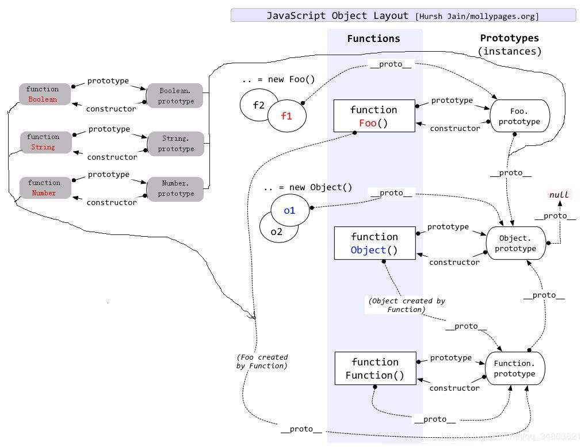

# 深入理解 js 对象创建

## 背景

在 js 中虽然`Object`构造函数或对象字面量都可以创建单个对象，但是这些方法都有一个明显的缺点：
使用同一个接口创建很多对象，会产生大量的重复代码。为了解决这些问题，人们提出了很多创建对象的解决方案，下面是我对 js 对象创建的一些理解和总结。

## 一、 Object 构造函数创建

```js
var Person = new Object();
Person.name = "p1";
Person.age = 29;
Person.job = "jser";
```

这行代码创建了 Object 引用类型的一个新实例，然后把实例保存在变量 Person 中。

## 二、 使用对象字面量创建

```js
var Person = {};//相当于var Person = new Object();
var Person = {
 name:'p1';
 age:29;
 sayName() {
   console.log(this.name)
 }
}

```

对象字面量是对象定义的一种简写形式，目的在于简化创建包含大量属性的对象的过程。也就是说，第一种和第二种方式创建对象的方法其实都是一样的，只是写法上的区别不同

在介绍第三种的创建方法之前，我们应该要明白为什么还要用别的方法来创建对象，也就是第一种，第二种方法的缺点所在：它们都是用了同一个接口创建很多对象，会产生大量的重复代码，就是如果你有 100 个对象，那你要输入 100 次很多相同的代码。那我们有什么方法来避免过多的重复代码呢，就是把创建对象的过程封装在函数体内，通过函数的调用直接生成对象。

## 三、 工厂模式

工厂模式就是软件工程领域一种广为人知的设计模式，这种模式抽离了创建对象的具体过程。考虑到在 ECMAScript 中无法创建类，开发人员发明了一种函数，用函数来封装以特定接口创建对象的细节。如下面的例子所示：

```js
function createPerson(name, age, job) {
  var o = new Object();
  o.name = name;
  o.age = age;
  o.job = job;
  o.sayName = function() {
    console.log(this.name);
  };
  return o;
}

const p1 = createPerson("p1", 20, "jser");
const p2 = createPerson("p2", 29, "phper");
```

**优点**：解决了创建多个相似对象时，代码的复用问题

**缺点**：使用工厂模式创建的对象，没有解决对象识别的问题（就是怎样知道一个对象的类型是什么）

## 四、 构造函数模式

前面我们提到，ECMAScript 中的构造函数可用来创建特定类型的对象。想 Object 和 Array 这样的原生构造函数，在运行时会自动在执行环境中。此外我们也可以创建自定义的构造函数，从而定义对象类型的属性和方法。我们使用构造函数的方法可以将前面的例子重写如下：

```js
function createPerson(name, age, job) {
  this.name = name;
  this.age = age;
  this.job = job;
  this.sayName = function() {
    console.log(this.name);
  };
  return this;
}

const p1 = new createPerson("p1", 20, "jser");
const p2 = new createPerson("p2", 29, "phper");
```

当我们使用构造函数实例化一个对象的时候， 对象中会包含一个包含一个 `__proto__` 属性指向构造函数的原型对象（即`p1.__proto__ === createPerson.prototype`），而原型对象中则包含一个 constructor 属性指向构造函数（即`createPerson.prototype.constructor === createPerson`）因此在实例对象中我们可以通过原型链来访问到`constructor`属性，从而判断对象的类型。

**优点**：解决了工厂模式中无法识别对象类型的问题，并且创建自定义的构造函数意味着将来可以将它的实例标识为一种特定的类型

**缺点**：我们知道 ECMAScript 中函数式对象，在使用构造函数对象时，每个方法都会在实例对象中重新创建一遍。拿上面的例子举例，sayName 函数每次都会创建一次，但是它们其实做的都是同样的工作，因此这样便会造成内存的浪费。

## 五、 原型模式

我们知道，我们创建的每一个函数都有一个`prototype`属性，这个属性指向函数的原型对象，这个对象的用途是包含可以由特定类型的所有实例共享的属性和方法。我们通过使用原型对象可以让所有的实例共享它包含的属性和方法，因此这样也解决了代码复用的问题。如下面所示：

```js
function createPerson() {

}

createPerson.prototype.name = 'p1'
createPerson.prototype.age = 28
createPerson.prototype.job = 'jser`
createPerson.prototype.sayName = function() {
  console.log(this.name)
}

const p1 = new Person()
p1.sayName()


const p2 = new Person()
p1.sayName()

```

与构造函数模式不同的是，原型对象上的属性和方法是所有实例共享的。也就是说, p1 和 p2 访问的都是同一组属性和同一个 sayName 方法

**优点**: 解决了构造函数模式中多次创建相同函数对象的问题，所有的实例共享同一组属性和函数

**缺点**：所有函数访问的同一组默认的属性，不能传参进行定制化，由于属性的共享，那么如果某个属性修改了引用类型的属性，那么将影响所有的实例

## 六、 组合使用构造函数模式和原型模式

创建自定义类型的最常见方式，就是组合使用构造函数模式和原型模式。构造函数模式用于定义实例属性，而原型模式用于定义方法和共享的属性。使用这种模式的好处就是，每个实例都会拥有自己的一份实例属性的副本，但同时又共享着对方法的引用，最大限度地节省了内存。而且这中混成模式还支持向构造函数传递参数，可以说是及两种模式之长。

下面我们那通过一个例子来展示这种模式：

```javascript
function createPerson(name, age, job) {
  this.name = name;
  this.age = age;
}

createPerson.prototype = {
  constructor: createPerson,
  sayName: function() {
    console.log(this.name);
  },
};

const p1 = new createPerson("p1", 20, "jser");
const p2 = new createPerson("p2", 29, "phper");

connsole.log(p1.sayName()); // jser
connsole.log(p2.sayName()); // phper

console.log(p1.sayName === p2.sayName);
```

**优点**：采用了构造函数模式和原型模式的优点，这种混成模式是目前使用最广泛，认同度最高的一种创建自定类型的方法。

**缺点**：由于使用了两种模式，因此对于代码的封装性来说不是很好。

## 七、 动态原型模式

由于上面混成模式存在封装性的问题，动态原型模式是解决这个问题的一个方案。这个方法把所有信息都封装到了构造函数中，而在构造函数中通过判断只初始化一次原型。下面我们来看一下例子

```javascript
function createPerson(name, age, job){
    this.name = name;
    this.age = age;
    this.job = job;

    if(typeof this.sayName !== "function" ){
        Person.prototype.sayName: function(){
            alert(this.name);
        }
    }
}

var p1 = new createPerson("james"，9，"student");

p1.sayName(); // "james"
```

注意在 if 语句中检查的可以是初始化后应该存在的任何属性或方法，不必要检查每一个方法和属性，只需要检查一个就行。

**优点**：解决了混成模式中封装性的问题

## 写在最后

简单总结了一下对象的创建方式，感觉收获很多，理解了每一种模式的优缺点后，以后才能更好的去应用。

附一张网上的关于原型链的图：


